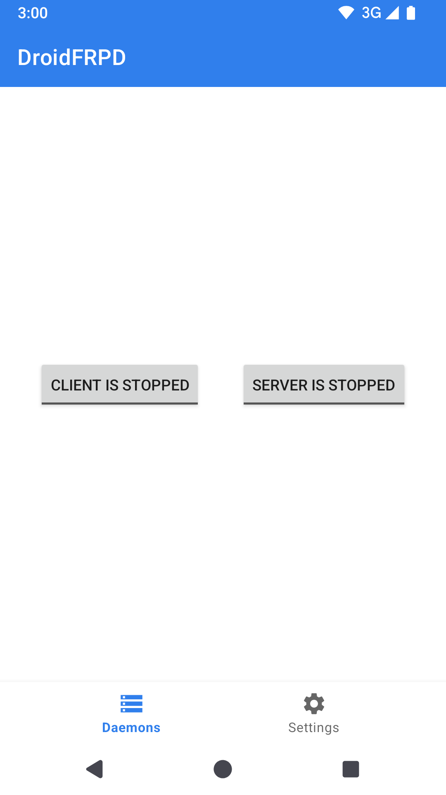
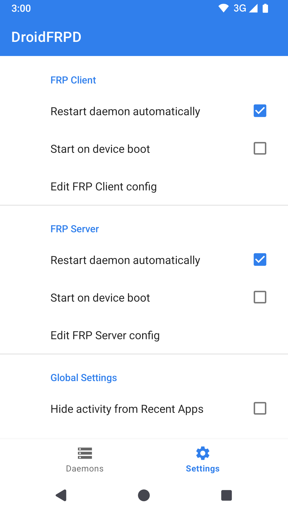
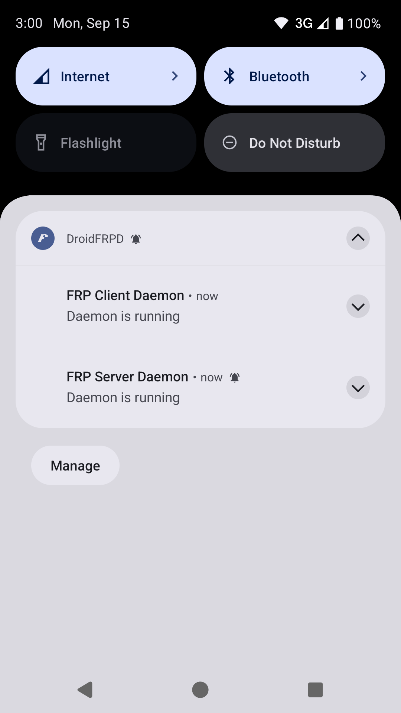
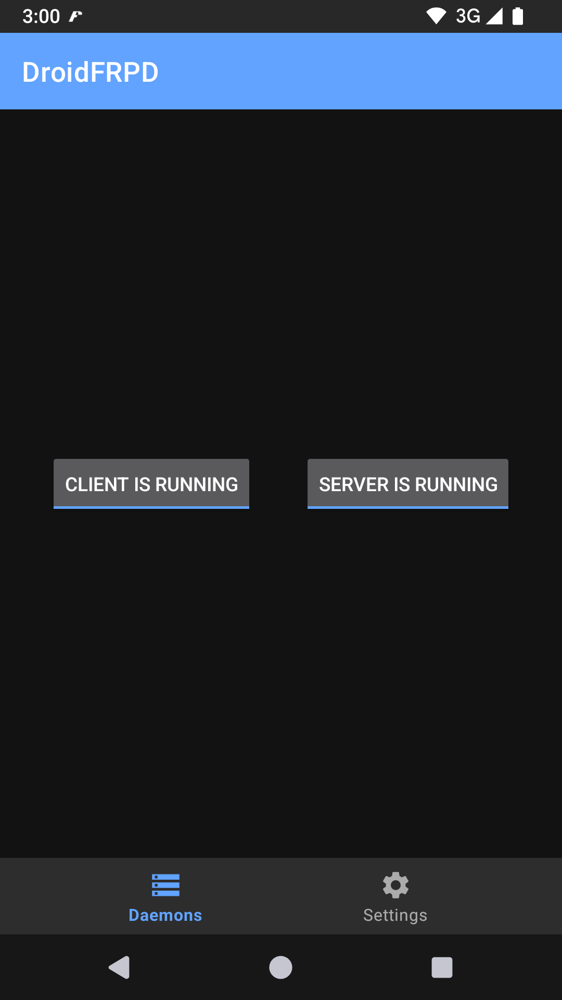

# DroidFRPD
This is an Android FRP daemon manager based on [fatedier/frp](https://github.com/fatedier/frp) project.

<!--suppress CheckImageSize -->
   

## Configurations
#### Manage configuration files
Aside of internal configuration editor, the configuration files can be managed via Files app or SAF-compliant apps.
#### Start daemon on device boot
You may have to grant start on boot permission manually.
#### Ignore battery optimization
There's an option in Settings that jumps to system battery optimization setting page.
#### Remove activity from recents
If enabled, DroidFRPD will be removed from Recent Activities, preventing it from being killed unexpectedly.

## Build app from source
Do following steps to build app (as well as 16KB-aligned core executables) from source:
- A Linux / macOS machine is recommended
- If opened with Android Studio, make sure version 2025.2.1 or later is installed (to be used with AGP 9+)
- Clone this repository with its submodule (using `--recursive`) and `cd` into cloned directory
- Install latest Android SDK (36 or later)
- Install AGP-recommended NDK version (Run `./gradlew ndkVersion --quiet` to check it out)
  - Or specify `ndk.version=<any installed NDK version>` in `local.properties`
  - NDK r28 or later is required
- Install latest Golang (or any version newer than that specified in `frp/go.mod`)
- Run `./gradlew assembleRelease` to build app (will run `go build` as well)
- Sign generated apk with your signatures

It's necessary to use 16KB-aligned core executables built from source if using on Android 16+ devices. However, in some cases you may prefer building the app with prebuilt frp binaries:
- A Linux / macOS machine is recommended
- Clone this repository and `cd` into cloned directory
- Install latest Android SDK
- Specify `frp.usePrebuiltExecutables=true` in `local.properties`
- Run `./gradlew assembleRelease` to build app
- Sign generated apk with your signatures

See `local.example.properties` for more build options.

